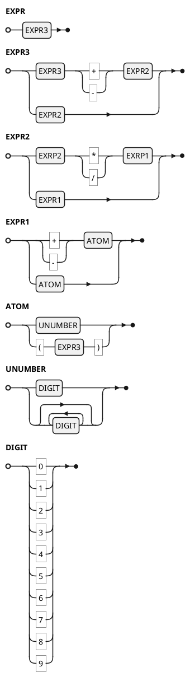
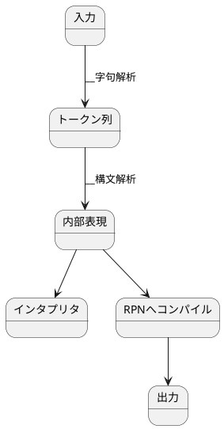

# Usage

```
$ cargo run
> 1 + 1
2
> 2 * 3 / (4 - 5)
-6
> 13+21
34
```

# Operators

| priority | symbol | associativity |
| -------- | ------ | ------------- |
| 3 (high) | +, -   | (unary ope)   |
| 2        | *, /   | left          |
| 1 (low)  | +, -   | left          |

# EBNF




# grand design



# Lexer

```
                  [0-9]
                 +------+
        [0-9]    ↓      |  [^0-9]
      +-------> [] ----- -----------> (Number)
      |
      |   +
[*] --|-------> (Plus)
      |
      |   -
      +-------> (Minus)
      |
      |   *
      +-------> (Asterisk)
      |
      |   /
      +-------> (Slash)
      |
      |   (
      +-------> (LParen)
      |
      |   )
      +-------> (RParen)
      
      
```